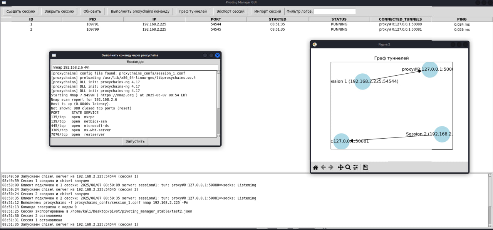

# Pivoting_manager

This tool is designed to automate tunnel creation using chisel-based pivoting techniques, and other types of tunnels will be added later. 

Current functionality:
1. Creating a tunnel
2. Logging 
3. Tunnel graph 
4. Export/import configuration
5. You can run a command through proxychains to verify 
6. When creating a tunnel, a file is automatically created.conf for proxychains

This is the first version with the basic chisel functionality (Dynamic Port Forwarding) and in the future other types of tunneling will be supported.

video test:

